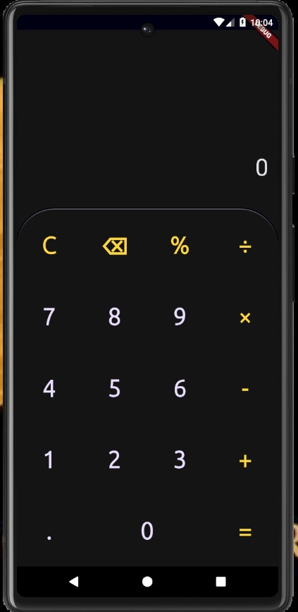
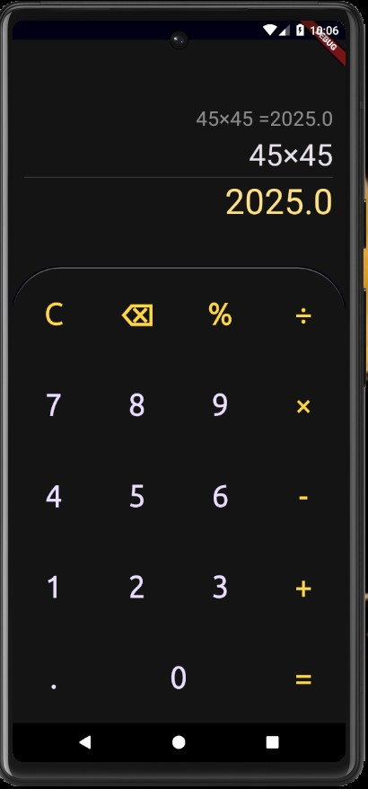

# Basic and Simple Mobile Calculator Application
```
It's a simple calculator app. 
And it only has one page and doesn't have many function.
```

## 1. App View
     


 ## 2. Algorithmic and Math way

 ```dart

 // Clear proccess
        if(getText=="C"){
            _history="";
            _result="";
            expression="0";
            _resultSize=37;
            operators="";
        }
        // Delete process
        else if(getText=="⌫"){
            if(expression.isNotEmpty) expression=expression.substring(0,expression.length-1);
            if(expression.length<1){
                expression="0";
            };
        }
        
        else if(getText=="="){
            if(expression.isNotEmpty&&expression!="0"){
                var user_exp=expression
                    .replaceAll("×", "*")
                    .replaceAll("÷", "/");

                ExpressionParser p=ShuntingYardParser();
                Expression exp=p.parse(user_exp);
                ContextModel cm=ContextModel();
                var finalResult=RealEvaluator(cm).evaluate(exp);
                var formatResult=(finalResult*100).roundToDouble()/100;
                _result=formatResult.toString();
                _history="$expression =$_result";
                
            }
            _resultSize=43;
            _historySize=25;
        
        }
        else if(expression.endsWith(".0")){
            expression=expression.substring(0,expression.length-1);
            
        }
        else{
            if(expression=="0"){
                expression=getText;
            }else getOperators(getText);
            
        }
    
    }
    catch(e){
        if(expression=="0") expression=getText;
        
        
    }
  }
  
  // avoid repeating operator symbols
  getOperators(String value){
    if(value=="%"||value=="÷"||value=="×"||value=="-"||value=="+"){
      if(expression.isEmpty&& value!="-") return;
      if(expression.isNotEmpty){
        String lastchr=expression[expression.length-1];
        if("+-×÷%".contains(lastchr)){
            expression=expression.substring(0,expression.length-1);
        }
      }
      
    }
    expression+=value;
  }

 ```

- To evaluate mathematical values.

  
    > we took easy way with  this `math_expressions` package,\
      so If user write math value like this 2x2 to input , \
      it will convetr Math evaluate from Math value.\
      So we took that short way form long way.

  ```dart
      else if(getText=="="){
            if(expression.isNotEmpty&&expression!="0"){
                var user_exp=expression
                    .replaceAll("×", "*")
                    .replaceAll("÷", "/");

                ExpressionParser p=ShuntingYardParser();
                Expression exp=p.parse(user_exp);
                ContextModel cm=ContextModel();
                var finalResult=RealEvaluator(cm).evaluate(exp);
                var formatResult=(finalResult*100).roundToDouble()/100;
                _result=formatResult.toString();
                _history="$expression =$_result";
                
            }
            _resultSize=43;
            _historySize=25;
        
        }
   ```
     
